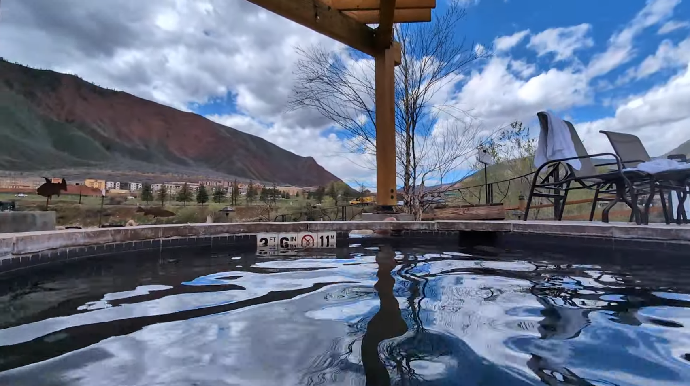
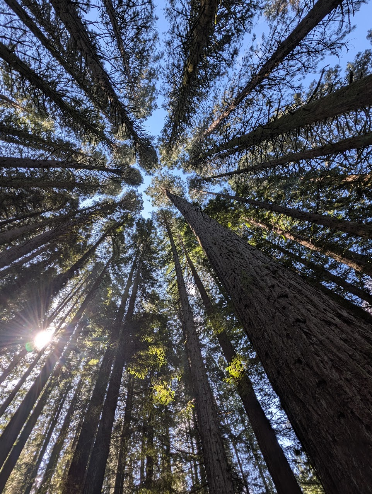
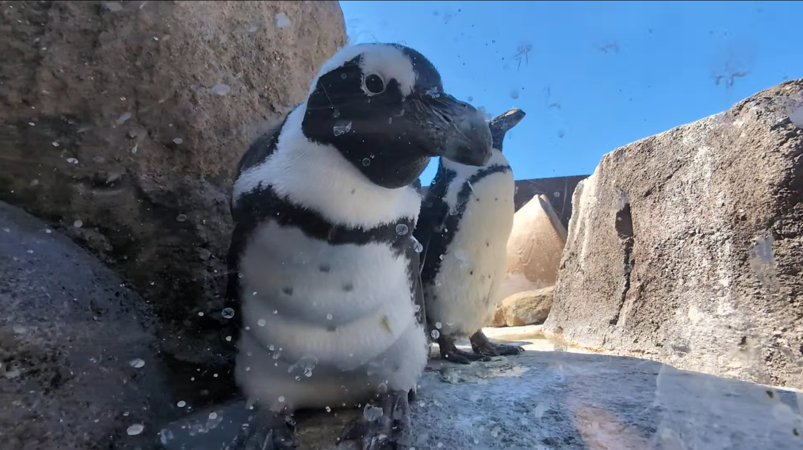
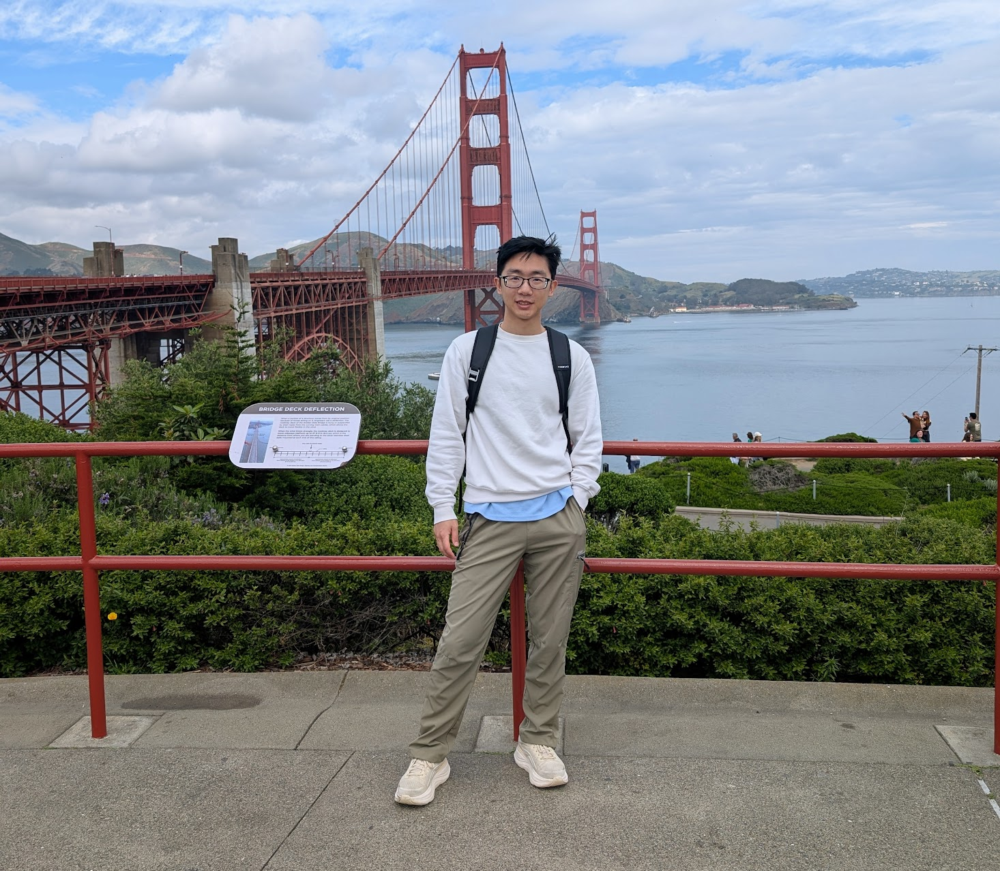
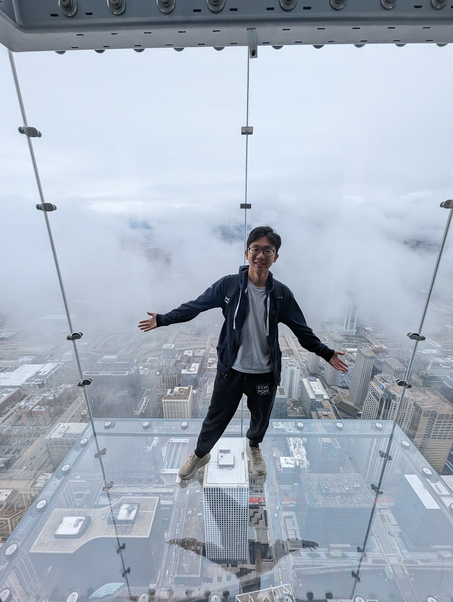

This blog post contains my reflections and learnings from my month-long Amtrak trip. For more on what I actually DID during the trip, check out [the vlog on YouTube](https://youtu.be/-7omBsuJeHs?si=W8bpdazUxdkEa8_t)

## Intro

Last year, I was asked to be a groomsman at a wedding in Seattle this March. I had just quit my job and was still recovering from a year of [bedrest](/blog/my-csf-leak-journey), but March felt like the right time to finally return back to society. I was tired of being stuck at home with my life on pause, and wanted to go out and travel the world before life got more complicated. But I was also hesitant about booking travel that I wasn't sure I'd be physically ready for. 

And so when I saw that Amtrak had a promotion for the US's 250th anniversary that bumped their 10-rail pass down to $250, it was the perfect, low-stakes sign to take that trip. 

The plan was to fly to Seattle for the wedding, then use the 10 trains to get back to the East coast over the course of a month, exploring each city for a few days. I'd visit and stay with friends along the way, but the majority of the trip would be spent solo traveling -- I wanted the flexibility to adjust my schedule based on how my body was feeling, plus I'd have a better chance at the fabled "self-discovery through travel" I've heard so much about. 

The month that followed derailed almost immediately, but still ended up where I had wanted to be. And I WAS able to discover more about myself. Just not in the way I expected. 

## Getting to Know My Body

#### Turbulent Start

The journey of my dreams started with a nightmare. 

Before my flight to Seattle even took off, I was already panicking. Were my head and spine going to be ok with the air pressure change? If I re-leak on the plane, would I be able to lie down in the aisle? What will all the other passengers think of me if we're forced to turn the plane around because of my medical emergency? 

We ended up in the air just fine, but then the motion sickness started. After managing for hours to keep it all in, we arrived 5 hours late at 2am. The friend I was staying with was asleep, and all the nearby hotels were booked out. I was on my way back from a hotel to try and sleep in the airport when my friend woke up and graciously picked me up at 4am. 

It was a rude awakening for the start of my trip, but surely it gets better from here? 

#### Bedrest Again

After a couple weeks in Seattle catching up with friends and attending the perfect wedding for the perfect couple, I started my solo traveling in Portland. At least, I tried to. On the third day, I found that my body would not get out of bed. The sleep deprivation and 20k step days were catching up to me, which left me frustrated at my weak body and at the precious time wasted. 

The same thing happened when I arrived in San Francisco after my first overnight train. A friend was showing me around Golden Gate Park taking me to the sports fields and windmills, then to the rest spots and benches because I could not physically stay awake. A couple days later, I was once again found my body unable to get out of bed. 

I was terrified that I might relapse. Over the past year of bedrest, I had already gone through several cycles of increasing my time out of bed, only to push myself too hard and be forced to restart bedrest. I didn't want that to happen on this trip, so I started considering if it was worth it to call it quits, fly back home, then try traveling again after more recovery. 

But then I realized that I had already planned for this. Sure I was being more active than I had intended to be, but I purposefully made my itinerary flexible for this exact scenario. 

So I rebooked some of my train tickets to give myself an extra day in SF and fully settled in to enjoy the rest of the day off. It paid off big, as I was perfectly alive for the rest of my SF stay. 

#### Resting in Bed

After realizing how important rest was going to be for my trip, I fully leaned in when I got to Glenwood Springs. This hot spring town wasn't on my original itinerary, but I decided to put it in last minute between SF and Denver to break up the 33 hour train ride into a more manageable 26 + 7. 

The first leg was still over a day long and left me exhausted and aching, but after soaking in the Iron Mountain Hot Springs and plopping onto my hotel bed, I felt rejuvenated. I spent the night watching YouTube while lying in bed, and had the best night of sleep the entire trip. 

After leaving Glenwood Springs, I continued blocking off my nights to rest. I stopped scheduling things for after dinner, and if hangouts looked like they might extend into the night, I'd make a gametime decision based on how I was feeling. 

These first few weeks felt like the season finale of my recovery story -- the culmination of the setbacks and learnings I've had over the past year and a half. I went into the trip less prepared than I thought I was, but yet again, through relapse fears and proper rest, I was able to come out the other end healthier and more resilient. This time without the extra months of bedrest. 

## Getting to Know Myself

#### Solo Travel as a Forcing Function

I've always had a weak or diluted personality. Never knew what to order at restaurants, never was confident about my decisions, never knew what I liked and didn't like. When interacting with others, I would mirror their feelings and desires, be unable to say no, and to top it all off, I was a notorious people pleaser. 

Solo traveling has forced me to exist alone, to find meaning in my days alone. I have to order food alone, no copying or asking others what they think, and then I have to deal with the consequences. I have to figure out what attractions I want to go to, then actually do the work of commuting there, experiencing it alone, and sitting with whatever feelings and thoughts bubble up. I have to acknowledge whatever tiredness or excitement my body conveys, and instead of ignoring or pushing down those feelings to accommodate for others, I give them space to surface and engage with them. 

As you can probably guess, I was quite horrible at making decisions at the start of my trip, constantly second guessing and grass is greener-ing. Like after I arrived exhausted in Glenwood Springs, when I struggled to decide whether to go straight to my hotel to crash, or to visit my first ever hot springs. Or when I only had enough time for one activity before my train out of Chicago and had to choose between the Museum of Science and the Art Institute. Or in Portland, when I froze after realizing I had left my suitcase in the back of my Uber. Or the dozens of meals and attractions I had to do alone while only being able to share my thoughts and feelings with myself. 

These things probably sound trivial. I'm just learning to live a life and have opinions and am making a big deal out of everyday occurrences. But I think it's in these micro decisions and actions that real change can occur. 

#### My Personality Fish

It feels like my feelings and desires and personality are like giant fish living at the bottom of an ocean. Stick with me here. Having been suppressed from my childhood (a story for another day), the fish have learned that it's safer the deeper they go. I'll occasionally see them surface when they're desperate for food, but for the most part, it's hard to spot them and even harder to know what they are and what they want. 

But as I've been traveling and experiencing new things, my personality fish have been emerging more often. I've begun studying their signs and subtleties, what scares them away, what piques their interest, how to help them grow. And what once seemed like trivialities (like ordering at restaurants and booking attractions) were actually the nourishment needed to coax my fish out from their shells. 

#### Fishing For My Personality

It wasn't like I suddenly became enlightened and was perfectly in tune with my internal self. But as the trip went along, I gradually found more and more moments where I broke out from the autopilot and manually steered myself towards what I felt like I truly wanted. 

In Portland, I had a busy day planned going from the Hoyt Arboretum in the morning to exploring several places downtown in the afternoon. Well once I got to the Redwoods viewing deck in the arboretum, I sat there bathing under the Redwood trees for what felt like forever. It was incredibly relaxing and made me want to continue exploring the arboretum, so I kept walking around and ended up staying till late into the afternoon. 

Something similar happened when I was staying at my first US hostels in Denver and Chicago. I chose to try hostels because I didn't know many people in these cities and wanted to try and make some new friends. My goal was to befriend and explore the city with at least one person in each hostel, but I ended up enjoying and valuing my time alone so much that I consciously prioritized it instead of saying yes to every invitation. As a recovering people pleaser, it felt uncomfortable declining invitations, but also liberating that I had other solo activities I actually wanted to do and prioritize. 

After I started actively listening to my personality fish and adjusting my schedule based on how they were feeling, I began to enjoy my travels in a way I've never experienced before. I stopped stressing about the perfect route, stopped caring about seeing every attraction, stopped burning myself to exhaustion. 

Started taking my sweet time hanging with penguins. 

## Getting to Know My Friends

During my bedrest year at home, I was socially deprived. Aside from family and medical staff, I met with just two friends who came to visit me in person. I thought I'd be dying to see people and talk face to face, but I actually didn't mind. I'd grown to enjoy my time alone, and my insecurities would always flare when hanging out with others so I was quite comfortable by myself. 

During this Amtrak trip alone, I caught up with over fifty friends and meaningfully met twenty new ones. I thought socializing this much would be exhausting, especially since I wouldn't have my own room for 90% of the trip. I did not expect for socializing to be by far my favorite part of my travels. 

#### Old Friends, New Lives

While living in Seattle when I was working, I didn't travel domestically very often besides the yearly work trip or spending the holidays at home. Because of this, it'd been almost 4 years since I last saw many of my college friends, a couple years since I last saw my old Seattle friends, and almost a decade since I last saw some high school friends. Thus I had very little idea what people were up to and how they lived their lives. 

In Seattle, many people had similar lives of clocking in and out of work, though many of my past coworkers were being overworked, had quit hobbies, and a few of them were contemplating quitting the job altogether. Other friends had deliberately built up lifestyles that they thoroughly enjoyed, like hosting coffee tastings, going to baking school, or coaching frisbee teams. Catching up with these Seattlites made me wonder what I'd be like if I had stayed...

Five of my Seattle friends had recently moved to SF, and while learning about how much more they enjoyed SF, it made me consider moving there too. 

A Chicago friend that I hadn't seen in 9 years (!) gave me perspective on retirement and made me truly consider if I'd enjoy early retirement or not. 

My Pittsburgh med school friends showed me what true delayed gratification looks like. I felt bad that I'd have to wake them at 5am for my train, but apparently they had to wake up at 4am everyday anyways for their rotations. I'll never complain about my SWE hours again. 

My best friend from high school quit his consulting job to pursue fitness, and it was so inspiring to see him live his dreams and thrive in his new career in Boston. 

And then NYC... I had initially planned my week with tons of rest each day, as I knew I'd be exhausted, but NYC had other plans. 

My lunch with a friend would turn into shopping in the afternoon with other friends joining, then we'd run into their friends on the street, then we'd all grab dinner, then we'd drop some people off, pick up some others, and I'd end the day with a full heart and not even exhausted. Each day was just a spontaneous, continuous journey, and I loved it. 

#### New Friends

This was also the reason I booked my first US hostels -- to see if I could find that same NYC spontaneity with strangers. 

In the first 10 minutes at my Denver hostel, I ran into an electrical engineer from Texas who was also solo traveling, and we got a few meals and explored some attractions together. Then in Chicago, I got to know an MIT pre-frosh who made me feel ancient with his vernacular, but we also got along and explored some museums together. 

The hostels were a success and the connections real, but they felt thinner compared to when I reconnected with my old friends. I think part of it is that my hostel friends were either at a different life stage or had a different outlook on life, and the fact that we were all exhausted and sleep deprived probably didn't help. 

While they weren't the close travel friendships that I had hoped they'd be, these hostel experiences showed me that even though deep connections with strangers is difficult to find, it IS possible. Maybe there needs to be more time together, or similarity, or better conditions like weather and sleep states for better connections to form. If only I could travel and stay in cities for months at a time... (stay tuned)

#### People Matter

The tallest building in Chicago is the Willis Tower, but most Chicagoans apparently pronounce it "Sears Tower." I visited the Skydeck there, a stomach-dropping attraction where you can stand over glass at 100+ stories tall, and it was very cool. 

But while waiting in line, I noticed that I was the only single traveler amongst a sea of couples and families and friend groups. That didn't stop me from thoroughly enjoying the glass floor, but it made me wonder how much more I'd have enjoyed the experience if I were with those close to me. 

This trip was supposed to be about SOLO travel where seeing friends were the side quest to the city and personal exploration. But when I went through my journal entries to write this blog post, I realized that I had forgotten about most of the attractions I went to, and it was the time spent with friends that were still clear as day. 

As a lifelong loner and introvert, this surprised me. I feel like I haven't been great at deeply connecting with people throughout my life, be it cause of insecurities or walls that I put up. But the past couple years have made me want to live life more fully and intentionally, and I think that made me more present and appreciative of my friendships. 

And seeing my friends' lifestyles and what they struggle with and enjoy about their days inspired me in ways they didn't before. I want to try prioritizing my exercise and health the way my Boston friend does. I want to wake up early with purpose like my med school friends. I want to be more appreciative of the long hours I don't have to work, the tests I don't have to study for, the bills I don't have to stress about. It felt like the hallway that was my life kept opening new doors, glimpses into worlds I wasn't familiar with. 

I realize that THIS is why people travel -- finding new perspectives to shake up how you normally think about your life and the world. This is what it means to "discover yourself" through travel. 

