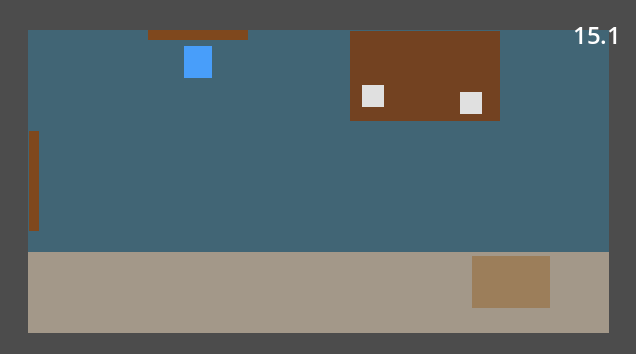
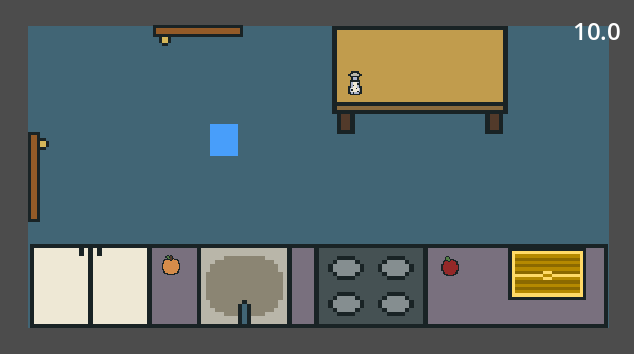
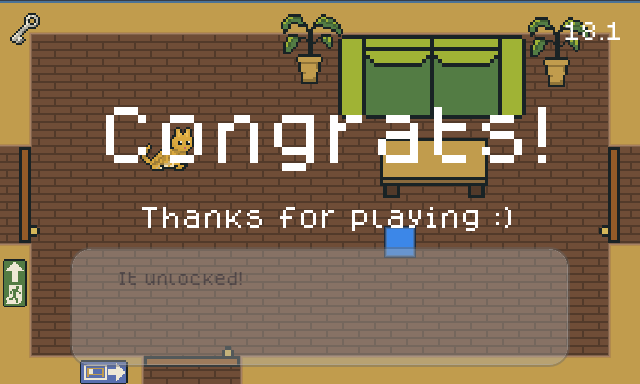

Like many programmers, what sparked my interest in coding was video games. Also like many programmers, I'd never seriously worked on a game outside of school projects. My only experience building games had come from GridWorld in AP Computer Science and in my college's Computer Graphics class. 

However, the perfect opportunity just arrived for me. About half a year ago, I quit my job to focus on healing from a medical thing, and I've been slowly exploring new hobbies and recovering my energy. When browsing Reddit a few weeks ago, I saw that a beginners game jam was happening, so I thought, what the heck, why not sign up. I'd been meaning to try game dev during my break, and this felt like the perfect chance for me to jump right in rather than forever waiting until I felt ready. 

I created an account on Itch.io, signed up for the 2-week jam, and enlisted the help of my brother. The first hiccup came when my brother decided to extend the trip he was on, so he'd be away for the first week. But I was still committed to completing the jam, even if I had to do it alone. The jam then started.  

## Ideation

It was 9:30pm on a Friday when the theme was revealed. "Healing". Game jams usually have a theme to 1) prevent people from building games before the start time and 2) add some flavor and fun to the jam. 

I spent that night brainstorming different "healing" games. Maybe we could do a roguelike where you heal things instead of fight them, or maybe a bunch of mini games about healing different patients, or maybe do a play on words and do something around "heels"... 

I went to bed without a clear idea of what I wanted to work on, but as I was ​trying to fall asleep, I came up with the perfect idea -- my current situation! I was in the middle of [healing from a csf leak](/blog/my-csf-leak-journey) and could only be upright for a certain amount of time before my head started hurting, and this felt like the perfect mechanic to build a game around!

For the next couple hours, I alternated between hopping out of bed to jot down notes in my phone and plopping back in bed to try and sleep. I envisioned the core gameplay loop of walking around a house until your time expires, then starting the next day again from bed. Maybe we could include ways to increase your timer that you slowly discover. Maybe we could include mysterious lore for why you have limited uptime. 

The next morning, after a night of little sleep, I started working on my first real game. 

## Prototyping

I got straight to work after waking up. I created a Github repo, titled it "The Vertical World", and booted up an empty Godot project. I wanted to try using Godot instead of a traditional game engine like Unity since Godot was lighter, open-source, and fit the game jam / indie vibe. 

I started by creating a player that could move around and assigned it a simple blue square as placeholder art. Then I created a bedroom with walls, a blue rectangle as a bed, and a brown rectangle for the desk. Next, I added a timer that, when expired, fades the screen out then spawns the player back at the bed. Core gameplay loop done. 

It was super exciting how quickly I was able to build. I had imagined game dev to be a laborious process requiring careful planning, but creating this first prototype proved way quicker and easier than I'd imagined. Before long, I had implemented notes that open a new UI, pills that could be consumed to prolong the day's timer, and multiple rooms that supported camera transitions. 

Soon enough, I started noticing patterns and ways to re-use code, and my 3 years of software engineering training kicked in. 

## Designing Systems

In basketball, one of the first things they teach you is triple threat. Whenever you catch the ball and see a defender in front of you, bring the ball to triple threat position. After enough practice, this becomes instinct and happens automatically. 

Three years of software engineering in big tech had drilled into me similar instincts. If I see any hardcoded strings, I shout "consts or enums!" If I see repeated code between classes, I yell "utils file or interfaces!" If I see classes depending on the same state, I scream "manager!!"

I was a little shook that I still remembered all this stuff after not working for a while, but also relieved that my three years of working had instilled in me some lasting skills. I was enjoying designing my RoomManager and GameManager and Interactable interface for objects that you can interact with, then extending it to a TimedInteractable for interactables that take time to complete. It took a fair bit of time and energy to design these systems, but adding new features became a breeze, and I quickly implemented fruits, running shoes, keys, a treadmill that permanently increases your timer, junk food that permanently decreases your timer, and more. 

However, investing time into clean code and separation of concerns meant less time for all the other things that building a game requires, and I'd soon learn how important balancing between disciplines would be. I couldn't just be a software engineer. I needed to be a game engineer. 

## Player Experience

One of my favorite genre of games is "Metroidbrainias", an combination of the "Metroidvania" genre and the word "brain". As a quick explanation, Metroidvanias are known for nonlinear exploration where players can acquire items to access new areas, often hidden in previous areas. MetroidBRAINias are a variation where instead of gating progression behind items and abilities, you also hide progress behind knowledge, where learning how to use this item or thing you've always had access to can unlock new paths. 

Having loved Tunic when I played it years ago, and having just finished Silksong (top tier metroidvania game), I really wanted to include some knowledge-based progression in our game. And so I came up with the idea that players can press certain keys to perform certain actions like pressing "O" to open something or "Shift" to sprint. These actions would always be available, but players would only learn about them once they progress enough. 

Initially, I went ham with these buttons and created new actions for everything. Want to open something? "O". Want to open something with a key? "K". Want to open and use something? "U". However, I realized that creating and assigning actions requires subtlety and nuance, lest player becomes confused and annoyed. This realization led to another realization and helped me finally understand what exactly "game designers" actually do. 

As much as I loved engineering the software systems, I loved this game designing even more. It was, ironically enough, like playing a puzzle game. A puzzle game where each puzzle piece has a dozen sides, and after you connect a few pieces, you realize that each new piece has to connect with several old pieces, and that you often need to rearrange or completely scrap pieces. There's no box art goal in mind, you're just arranging pieces into something you think is cool. 

And so the days went... I'd create a new manager for audio, then think about how many chest opens we should require before we spawn a knowledge note. I'd move some repeated numbers to become global consts, then hide a key item in the starting room. I'd spend hours trying to dynamically switch between camera modes before realizing that time was better spent coming up with new rooms. 

I loved every minute of it. Even when I was debugging, I was enjoying myself. Before long, the game jam had entered the final few days, and I had encountered the final boss -- Art. 

## The Art

I'm a programmer and gamer. I can do a little music, but I do not have much experience with art. I had tried to explore pixel art a couple years ago, but didn't make it past the first week. But the game jam was ending in 3 days, and our game still only had solid-colored rectangles. We needed art. 

I like art and think pixel art is awesome. I had actually looked forward to doing the art for a game when I first joined the jam. But now that I had tons of bugs and new features I wanted to design and implement, doing the art felt like a chore, and I knew that whatever the tedious process resulted in, the perfectionist in me would cringe at. 

I gritted my teeth and booted up Aseprite. I googled images of pixel art chests. I redrew the simplest designs I could find. After a couple minutes, it was done. So fast. I drew an open version of the chest, and it took even less time. I then drew simple tables and a couch. Doors, sinks, tables, the bed... all done in minutes. 

I was amazed. I knew the drawings weren't great, but I could confidently tell what they were supposed to be, and that was better than I thought I'd do. I knew pixel art was simpler than other forms of drawing, but it felt like a cheat code how quick and easy it was to create workable assets. 

I found that I was looking forward to the art and the fulfillment that came from turning what seemed like a difficult and tedious job into a quick and fun one. Before long, I had all the art done for the furniture, the icons, and even some decorations. The game was starting to look like an actual game. 

## Polish

My brother had actually started helping while he was still away on his trip, implementing a couple small features with my guidance. It almost felt like we had an intern on the team. 

However, he really showed his chops when he started working on the audio. He's been playing various instruments in various groups ever since he was little, and so he took charge of the SFX (sound effects) and music. And he nailed it. He found royalty free SFX online and tweaked them in Audacity to get them to fit our game, then he mocked up a catchy lofi beat that we then spent several hours jamming on and refining. 

My brother and I both did a lot of music growing up, but we never really collaborated past playing in the same high school band for one year. So when we were sitting at his desk trying out different chord variations and melodies, it felt special and like a long time coming that we could finally work on a piece of music together. 

While he was focusing on the audio, I was adding some quality of life features like sprint toggling and floating icons for when you use an item. I also made a basic tileset and explored Godot's top tier tiling system. After just a day or two of audio and visual polish, the game suddenly started coming together. The game was taking on its own atmosphere with its lofi music, crisp sound effects, and low-poly art. We had actually made a game. 

Well, not quite, since we still didn't have a win screen or a finalized title. We did some brainstorming and decided on a long hallway that you have to run down to win, and settled on the title "Bed Rested" with a space in the middle because it looked better on the title screen. 

And there it was. Our game was finished. You can play it [here](https://masiloh.itch.io/bed-rested). We took some screenshots for the Itch page and wrote a short description, then submitted our first game to our first game jam. 

## Learnings

I learned SO much during these 2 weeks. Here's a rapid fire recap: 
- Software engineering principles and clean code are super relevant for game dev. Investing some time upfront leads to faster prototyping. 	
- Pixel art is not scary. Getting simple art done is fast and fun, and I've completely changed my attitude towards it. 
- Game dev is a process. Adapting as you playtest is both fun in that it's a puzzle to solve, but also necessary as you only discover gameplay nuances after playing multiple times. 
- You need to wear a lot of hats. It reminds me of startups where you need to fulfill many roles. For being a solo or near-solo dev, you need to figure out coding, art, game design, writing, music, and more. 
- Most importantly, I learned that I love game dev. Granted, it's only been the first two weeks and the honeymoon phase is still going strong, but making games combines the mental satisfaction from coding systems and solving puzzles with the excitement from tackling new problems in several disciplines, all at once. 

## What's Next

The day after the game jam ended, we found out that we had gotten first place in the overall rankings. This jam was pretty small with only 15 submissions, and we probably put in more hours than most other teams, but it still felt incredible and was the cherry on top of an already fulfilling experience. 

In total, I worked about 60 hours, averaging 4-5 hours a day for 2 weeks. I enjoyed every minute and knew that I wanted to keep making games and doing game jams. In fact, the day after we found out that we had won, I had already joined another game jam. More on that soon... 

But this game jam also felt satisfying in a completely different way. While working on the game and thinking about how to design the player's timer, I myself was on my own timer, alternating between lying in bed and working on the game. After completing the game, it felt like part of me had also healed. And I'm not even saying this to be corny or dramatic. I haven't felt this much excitement and drive to work on a project in who knows how long. 

For the past few months, I've slowly been recuperating and starting to exercise again and going outside more, but I'd still label myself as "sick" or "injured." It feels like with the completion of this game jam, I might finally be starting to step across the line from considering myself "injured" to... something better. Not "healthy" yet, but definitely moving away from "injured"... I guess that's just the definition of "Healing."